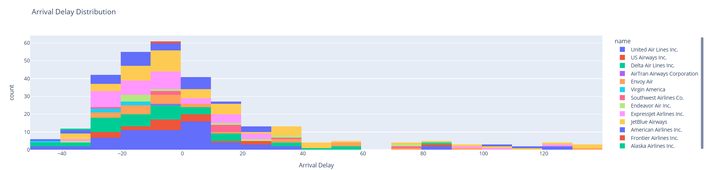
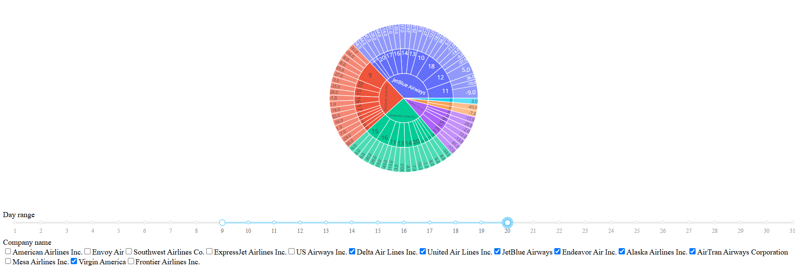
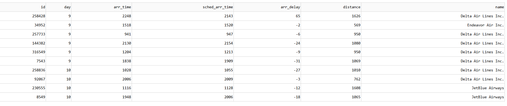

# Management Dashboard For Flight analysis of airline companies
 
In this project, using interactive charts, airline flights are analyzed, especially in terms of flight delays.

For this purpose, Python language, Plotly and Dash packages have been used.

### Sample parts of the project :

